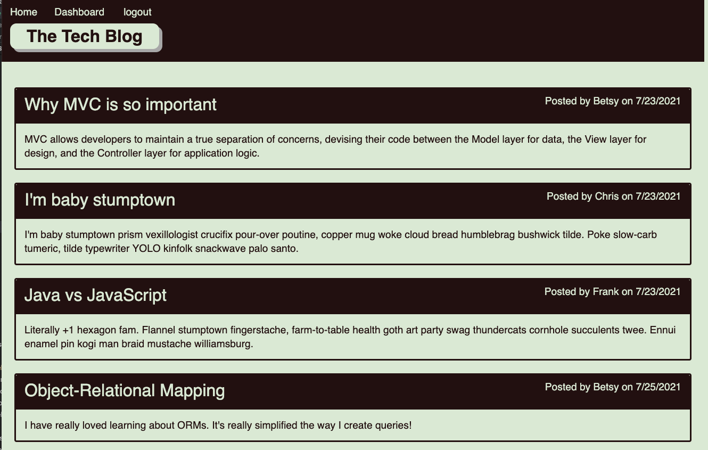

# my-tech-blog
## Description

I wrote this application to create a website for posting short tech related blogs.  This was also a good opportunity to practice creating websites with the technologies I am learning in class. 

YOu can take a look at the application at:

## Table of Contents
- [Installation](#installation)
- [Usage](#usage)
- [Credits](#credits)
- [Questions](#questions)
- [License](#license)

## Installation
To install this app you would need to clone the repo to your github and then use heroku and JAWS_DB to host the website.  You will need to create an .env file (with parameters: DB_NAME=my_tech_blog_db, DB_USER=<your username>, DB_PASSWORD=<your password>) for local testing and enter those parameters into heroku for the launched site.
## Usage
Once the app is running you can create accounts by clicking on the "login" navigation element and then moving over to the "Create user instead" link.  Enter the info and create the account and you will be logged in and ready to create posts by going to your dashboard.  You can also view other's posts from the homepage.  If you click on someone's post, you can enter a comment.  If you click on your own post from your dashboard, you can edit or delete the post.
## Credits
For this project I used: 
- bcrypt (5.0.1) to handle the hashing of the user passwords
- connect-session-sequelize (7.1.1) to handle the session data within Sequelize
- dotenv (10.0.0) to store my database access credentials without sharing them with the world wide web 
- express (4.17.1) as my Node.js framework
- express-handlebars (5.3.2) as my templating engine
- express-session (1.17.2) to handle the session maintenance
- mysql2 (2.2.5) to interface Sequelize to my MySQL database
- sequelize (6.6.5) to create data models to aid in accessing teh database
## Questions
If you have any questions you can contact the author through his github user profile: https://github.com/bdstpierre
or by sending an email to barry@stpierre.com
## License
Copyright 2021 Barry St. Pierre

    Permission is hereby granted, free of charge, to any person obtaining a copy of this software and associated documentation files (the "Software"), to deal in the Software without restriction, including without limitation the rights to use, copy, modify, merge, publish, distribute, sublicense, and/or sell copies of the Software, and to permit persons to whom the Software is furnished to do so, subject to the following conditions:
    
    The above copyright notice and this permission notice shall be included in all copies or substantial portions of the Software.
    
    THE SOFTWARE IS PROVIDED "AS IS", WITHOUT WARRANTY OF ANY KIND, EXPRESS OR IMPLIED, INCLUDING BUT NOT LIMITED TO THE WARRANTIES OF MERCHANTABILITY, FITNESS FOR A PARTICULAR PURPOSE AND NONINFRINGEMENT. IN NO EVENT SHALL THE AUTHORS OR COPYRIGHT HOLDERS BE LIABLE FOR ANY CLAIM, DAMAGES OR OTHER LIABILITY, WHETHER IN AN ACTION OF CONTRACT, TORT OR OTHERWISE, ARISING FROM, OUT OF OR IN CONNECTION WITH THE SOFTWARE OR THE USE OR OTHER DEALINGS IN THE SOFTWARE.
    
    
## Features

## How to Contribute

## Tests

